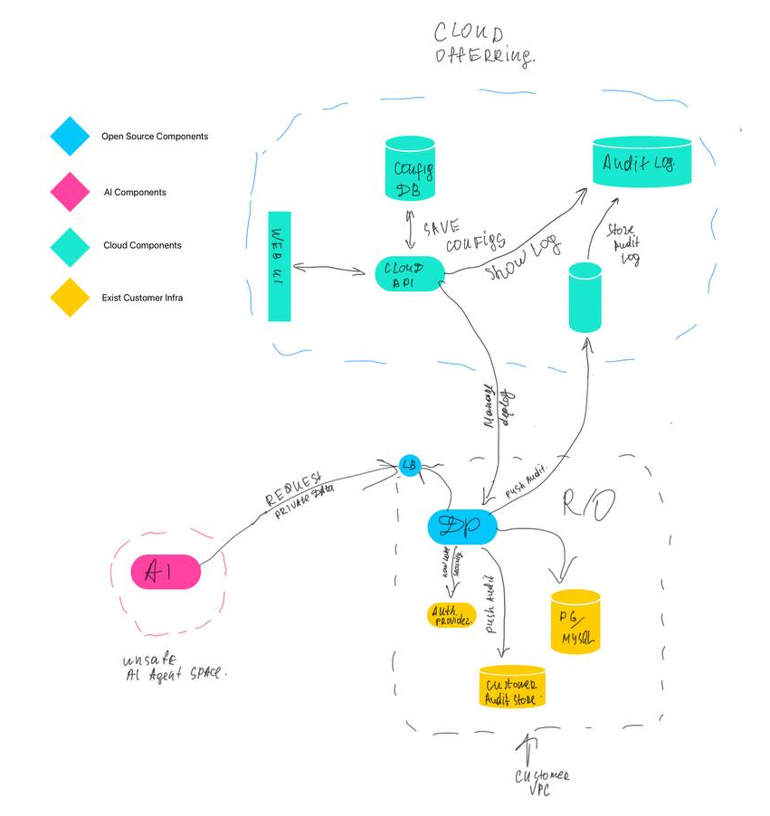
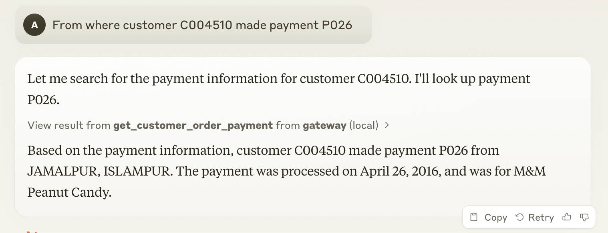

<h1 align="center">CentralMind Gateway: AI-First Data Gateway</h1>

<div align="center">

## 🛸 Introduction

</div>

AI agents and LLM-powered applications need fast, secure access to data, but traditional APIs and databases aren’t built for this. We’re building an API layer that automatically generates secure, LLM-optimized APIs on top of your structured data.

- Filters out PII and sensitive data to ensure compliance with GDPR, CPRA, SOC 2, and other regulations.
- Adds traceability and auditing, so AI applications aren’t black boxes and security teams can control.
- Optimizes for AI workloads, supports Model Context Protocol (MCP) with extra meta information to help AI agents understand APIs, caching and security.

Our first users are companies deploying AI agents for customer support and analytics, where they need models to access the right data without security risks or compliance headaches.


<div align="center">

## Design

</div>



## How to run

```shell
go build .
./gateway start --config ./example/gateway.yaml
```

### Docker compose

```shell
docker compose up ./example/docker-compose.yml
```

### MCP Protocol

Gateway implement MCP protocol, for easy access to your data right from claude, to use it

1. Build binary
    ```shell
    go build .
    ```
2. Add gateway to claude integrations config:
   ```json
   {
    "mcpServers": {
        "gateway": {
            "command": "PATH_TO_GATEWAY_BINARY",
            "args": [
                "start", 
                "--config",
                "PATH_TO_GATEWAY_YAML_CONFIG", 
                "mcp-stdio"
            ]
        }
    }
   }
   ```
3. Ask something regards your data:
   
