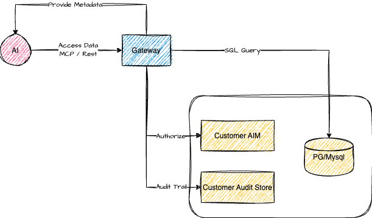

<h1 align="center">CentralMind Gateway: AI-First Data Gateway</h1>

<div align="center">

## 🛸 Introduction

</div>

<a href="https://codespaces.new/centralmind/sample_databases"> 🚀 Interactive Demo via Github CodeSpaces </a>

AI agents and LLM-powered applications need fast, secure access to data, but traditional APIs and databases aren't built for this purpose. We're building an API layer that automatically generates secure, LLM-optimized APIs for your structured data.

Our solution:

- Filters out PII and sensitive data to ensure compliance with GDPR, CPRA, SOC 2, and other regulations
- Adds traceability and auditing capabilities, ensuring AI applications aren't black boxes and security teams maintain control
- Optimizes for AI workloads, supporting Model Context Protocol (MCP) with enhanced meta information to help AI agents understand APIs, along with built-in caching and security features

Our primary users are companies deploying AI agents for customer support, analytics, where they need models to access the data without direct SQL access to databases elemenating security, compliance and peformance risks.


## Features

- ⚡ **Automatic API Generation** – Creates APIs automatically using LLM based on table schema and sampled data
- 🗄️ **Structured Database Support** – Supports <a href="https://docs.centralmind.ai/connectors/postgres/">PostgreSQL</a>, <a href="https://docs.centralmind.ai/connectors/mysql/">MySQL</a>, <a href="https://docs.centralmind.ai/connectors/clickhouse/">ClickHouse</a>, and <a href="https://docs.centralmind.ai/connectors/snowflake/">Snowflake</a>
- 🌍 **Multiple Protocol Support** – Provides APIs as REST or MCP Server including SSE mode
- 📜 **API Documentation** – Auto-generated Swagger documentation and OpenAPI 3.1.0 specification
- 🔒 **PII Protection** – Implements <a href="https://docs.centralmind.ai/plugins/pii_remover/">regex plugin</a> or <a href="https://docs.centralmind.ai/plugins/presidio_anonymizer/">Microsoft Presidio plugin</a> for PII and sensitive data redaction
- ⚡ **Flexible Configuration** – Easily extensible via YAML configuration and plugin system
- 🐳 **Deployment Options** – Run as a binary or Docker container with ready-to-use <a href="https://docs.centralmind.ai/helm/gateway/">Helm chart</a>
- 🤖 **Multiple AI Providers Support** - Support for [OpenAI](https://docs.centralmind.ai/providers/openai), [Anthropic](https://docs.centralmind.ai/providers/anthropic), [Amazon Bedrock](https://docs.centralmind.ai/providers/bedrock) & [Google VertexAI](https://docs.centralmind.ai/providers/anthropic-vertexai)
- 📦 **Local & On-Premises** – Support for <a href="https://docs.centralmind.ai/providers/local-models/">self-hosted LLMs</a> through configurable AI endpoints and models
- 🔑 **Row-Level Security (RLS)** – Fine-grained data access control using <a href="https://docs.centralmind.ai/plugins/lua_rls/">Lua scripts</a>
- 🔐 **Authentication Options** – Built-in support for <a href="https://docs.centralmind.ai/plugins/api_keys/">API keys</a> and <a href="https://docs.centralmind.ai/plugins/oauth/">OAuth</a>
- 👀 **Comprehensive Monitoring** – Integration with <a href="https://docs.centralmind.ai/plugins/otel/">OpenTelemetry (OTel)</a> for request tracking and audit trails
- 🏎️ **Performance Optimization** – Implements time-based and <a href="https://docs.centralmind.ai/plugins/lru_cache/">LRU caching</a> strategies

## How it Works

<div align="center">



</div>

### 1. Connect & Discover

Gateway connects to your structured databases like PostgreSQL and automatically analyzes the schema and data samples
to generate an optimized API structure based on your prompt. LLM is used only on discovery stage to produce API configuration.
The tool uses AI services ([OpenAI or compatible providers](https://docs.centralmind.ai/providers)) to generate the API configuration while ensuring security
through PII detection.

### 2. Deploy

Gateway supports multiple deployment options from standalone binary, docker or <a href="https://docs.centralmind.ai/example/k8s/">Kubernetes</a>.
Check our <a href="https://docs.centralmind.ai/docs/content/getting-started/launching-api/">launching guide</a> for detailed
instructions. The system uses YAML configuration and plugins for easy customization.

### 3. Use & Integrate

Access your data through REST APIs or Model Context Protocol (MCP) with built-in security features.
Gateway seamlessly integrates with AI models and applications like <a href="https://docs.centralmind.ai/docs/content/integration/langchain/">LangChain</a>,
<a href="https://docs.centralmind.ai/docs/content/integration/chatgpt/">OpenAI</a> and
<a href="https://docs.centralmind.ai/docs/content/integration/claude-desktop/">Claude Desktop</a> using function calling
or <a href="https://docs.centralmind.ai/docs/content/integration/cursor/">Cursor</a> through MCP. You can also <a href="https://docs.centralmind.ai/plugins/otel/">setup telemetry</a> to local or remote destination in otel format.

## Documentation

### Getting Started

- <a href="https://docs.centralmind.ai/docs/content/getting-started/quickstart/">Quickstart Guide</a>
- <a href="https://docs.centralmind.ai/docs/content/getting-started/installation/">Installation Instructions</a>
- <a href="https://docs.centralmind.ai/docs/content/getting-started/generating-api/">API Generation Guide</a>
- <a href="https://docs.centralmind.ai/docs/content/getting-started/launching-api/">API Launch Guide</a>

### Additional Resources

- <a href="https://docs.centralmind.ai/docs/content/integration/chatgpt/">ChatGPT Integration Guide</a>
- <a href="https://docs.centralmind.ai/connectors/">Database Connector Documentation</a>
- <a href="https://docs.centralmind.ai/plugins/">Plugin Documentation</a>

## How to Build

```shell
# Clone the repository
git clone https://github.com/centralmind/gateway.git

# Navigate to project directory
cd gateway

# Install dependencies
go mod download

# Build the project
go build .
```

## API Generation

Gateway uses LLM models to generate your API configuration. Follow these steps:

1. Create a database connection configuration file (`connection.yaml`):

```yaml
type: postgres
hosts:
  - localhost
user: 'your-database-user'
password: 'your-database-password'
database: 'your-database-name'
port: 5432
```

2. Choose one of our supported AI providers:

- [OpenAI](https://docs.centralmind.ai/providers/openai) and all OpenAI-compatible providers
- [Anthropic](https://docs.centralmind.ai/providers/anthropic)
- [Amazon Bedrock](https://docs.centralmind.ai/providers/bedrock)
- [Google Vertex AI (Anthropic)](https://docs.centralmind.ai/providers/anthropic-vertexai)

Configure AI provider authorization. For OpenAI, set an API key.

```bash
export OPENAI_API_KEY='yourkey'
```

3. Run the discovery command:

```shell
./gateway discover \
  --ai-provider openai \
  --config connection.yaml \
  --prompt "Generate for me awesome readonly API"
```

4. Monitor the generation process:

```shell
INFO 🚀 API Discovery Process
INFO Step 1: Read configs
INFO ✅ Step 1 completed. Done.

INFO Step 2: Discover data
INFO Discovered Tables:
INFO   - payment_dim: 3 columns, 39 rows
INFO   - fact_table: 9 columns, 1000000 rows
INFO ✅ Step 2 completed. Done.

# Additional steps and output...

INFO ✅ All steps completed. Done.

INFO --- Execution Statistics ---
INFO Total time taken: 1m10s
INFO Tokens used: 16543 (Estimated cost: $0.0616)
INFO Tables processed: 6
INFO API methods created: 18
INFO Total number of columns with PII data: 2
```

5. Review the generated configuration in `gateway.yaml`:

```yaml
api:
  name: Awesome Readonly API
  description: ''
  version: '1.0'
database:
  type: postgres
  connection: YOUR_CONNECTION_INFO
  tables:
    - name: payment_dim
      columns: # Table columns
      endpoints:
        - http_method: GET
          http_path: /some_path
          mcp_method: some_method
          summary: Some readable summary
          description: 'Some description'
          query: SQL Query with params
          params: # Query parameters
```

## Running the API

### Run locally

```shell
./gateway start --config gateway.yaml rest
```

### Docker Compose

```shell
docker compose -f ./example/simple/docker-compose.yml up
```

### MCP Protocol Integration

Gateway implements the MCP protocol for seamless integration with Claude and other tools. For detailed setup instructions, see our <a href="https://docs.centralmind.ai/docs/content/integration/claude-desktop/">Claude integration guide</a>.

1. Build the gateway binary:

```shell
go build .
```

2. Configure Claude Desktop tool configuration:

```json
{
  "mcpServers": {
    "gateway": {
      "command": "PATH_TO_GATEWAY_BINARY",
      "args": ["start", "--config", "PATH_TO_GATEWAY_YAML_CONFIG", "mcp-stdio"]
    }
  }
}
```

## Roadmap

It is always subject to change, and the roadmap will highly depend on user feedback. At this moment,
we are planning the following features:

#### Database and Connectivity

- 🗄️ **Extended Database Integrations** - Redshift, S3 (Iceberg and Parquet), Oracle DB, Microsoft SQL Server, Elasticsearch
- 🔑 **SSH tunneling** - ability to use jumphost or ssh bastion to tunnel connections

#### Enhanced Functionality

- 🔍 **Advanced Query Capabilities** - Complex filtering syntax and Aggregation functions as parameters
- 🔐 **Enhanced MCP Security** - API key and OAuth authentication

#### Platform Improvements

- 📦 **Schema Management** - Automated schema evolution and API versioning
- 🚦 **Advanced Traffic Management** - Intelligent rate limiting, Request throttling
- ✍️ **Write Operations Support** - Insert, Update operations
