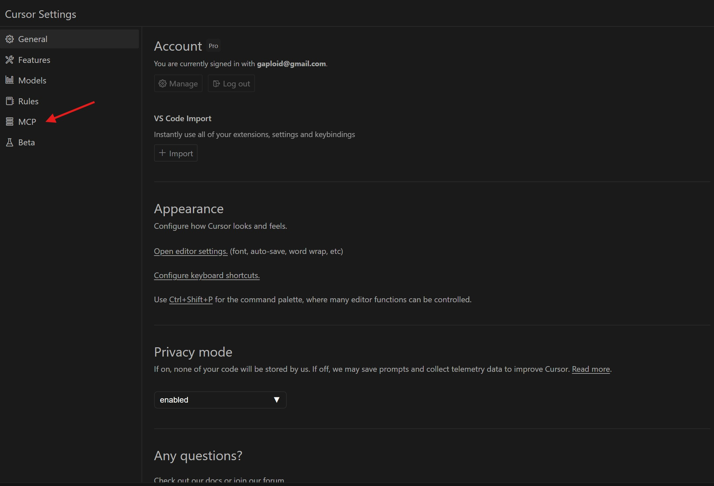
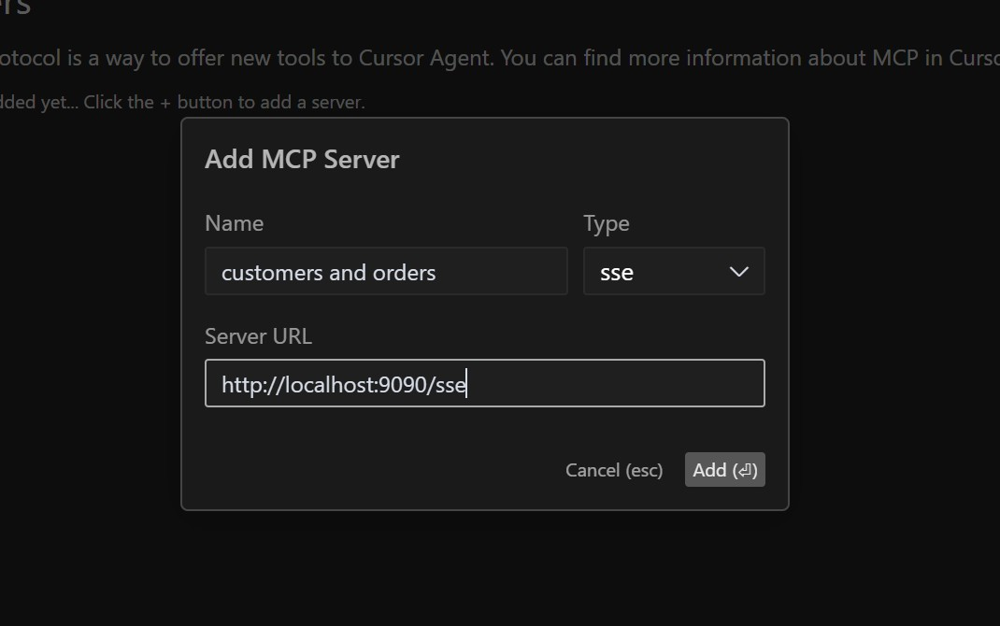
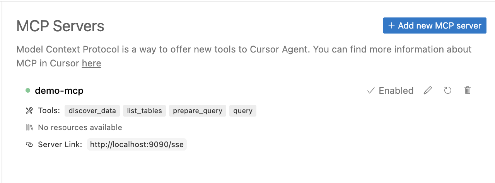
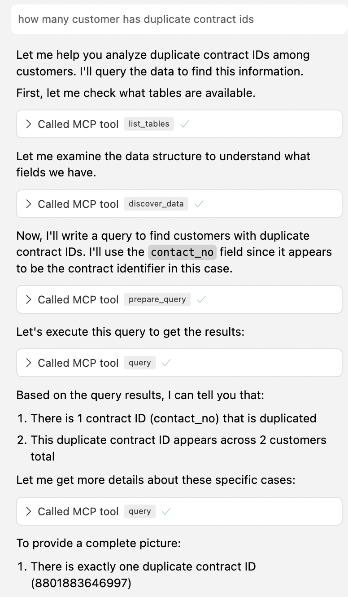

This guide explains how to use Gateway in MCP Raw mode, which provides direct database access through a structured interface.

## Prerequisites

- <a href="https://www.cursor.com/downloads">Cursor IDE</a> installed on your system
- <a href="/docs/content/getting-started/launching-api#using-mcp-stdinout-mode">API running in MCP mode</a>

## Connection Steps

### 1. Open Cursor Settings

Navigate to Cursor IDE settings to configure the API connection:

1. Open Cursor
2. Click on the Cursor's Settings icon in the top right corner
3. Navigate to the MCP section

### 2.1 Configure MCP Connection Using STDIO Mode

In the MCP settings:

1. Click the `Add new MCP server` button
2. Set the name of your MCP server
3. Choose `sse` as the connection type
4. In the URL field, enter: `http://localhost:9090/sse`
5. Save the settings
6. Verify that the newly added MCP server is highlighted in green and tools are listed in the description

### 3. Verify Connection

To verify that the connection is working:

1. Open Cursor's chat window
2. Type: `what mcp tools do you have`
3. Cursor should display a list of available tools

### 4. Run flow

The typical workflow follows these steps:

1. Use `list_tables` to view available tables
2. Use `discover_data` to examine table structures and sample data
3. Use `prepare_query` to validate your SQL query
4. Use `query` to execute the query and get results

## Troubleshooting

If you encounter connection issues:

1. Verify that the API server is running and accessible
2. Check the endpoint URL configuration
3. Ensure no firewalls are blocking the connection
4. Review Cursor logs for error messages
