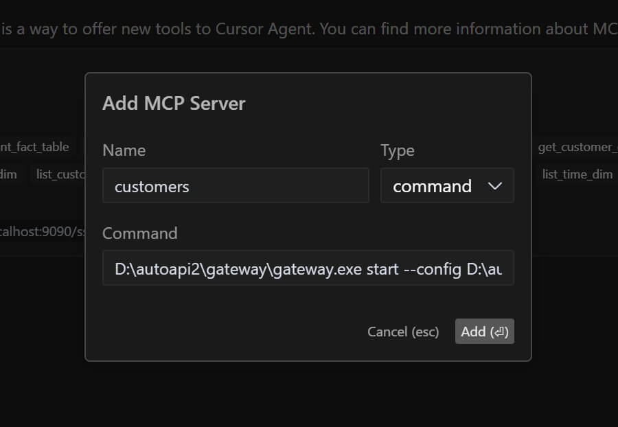
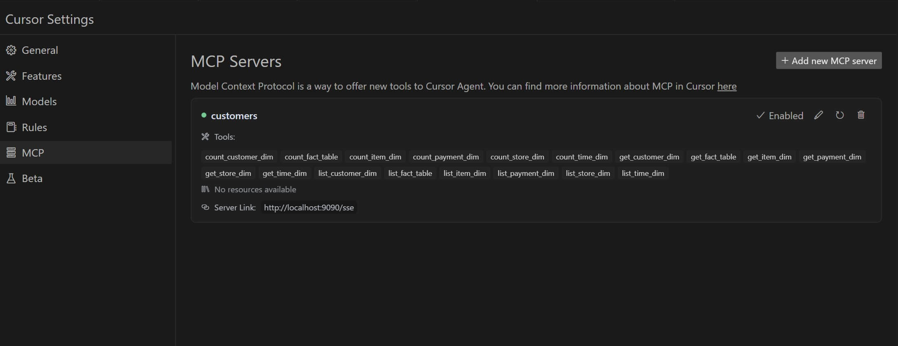

This guide will help you set up and connect your API running in MCP (Model-Context-Protocol) mode to Cursor IDE.

## Prerequisites

- <a href="https://www.cursor.com/downloads">Cursor IDE</a> installed on your system
- <a href="/docs/content/getting-started/launching-api#using-mcp-stdinout-mode">API running in MCP mode</a>

## Connection Steps

### 1. Open Cursor Settings

Navigate to Cursor IDE settings to configure the API connection:

1. Open Cursor
2. Click on Cursor Settings icon in the top right corner
3. Navigate to MCP section

### 2.1 Configure MCP Connection using STDIO mode

In the MCP settings:

1. Find the `Add new MCP server` button
2. Set the name of MCP server
2. Choose `command` type of the connection. 
3. Paste to command field: `%Path_To_Gateway_Binary% start --config %Path_To_Config_Yaml%/gateway.yaml mcp-stdio` 
4. Save the settings
5. Make sure that a newlly added MCP server highlighted with greet and there are tools listed in description

### 2.2 Optional, Configure MCP connection using SSE mode

In the MCP settings:

1. Find the `Add new MCP server` button
2. Set the name of MCP server
2. Choose `sse` type of the connection. 
3. Paste to command field: `http://localhost:9090/sse` 
4. Save the settings
5. Make sure that a newlly added MCP server highlighted with greet and there are tools listed in description

### 3. Verify Connection

To verify the connection is working:

1. Open Cursor's chat window
2. Try to ask: `what mcp tools do you have`
3. Cursor should return you a list of avaialble tools

## Troubleshooting

If you encounter connection issues:

1. Verify API server is running and accessible
2. Check endpoint URL configuration
3. Ensure no firewall blocking
4. Review Cursor logs for error messages
