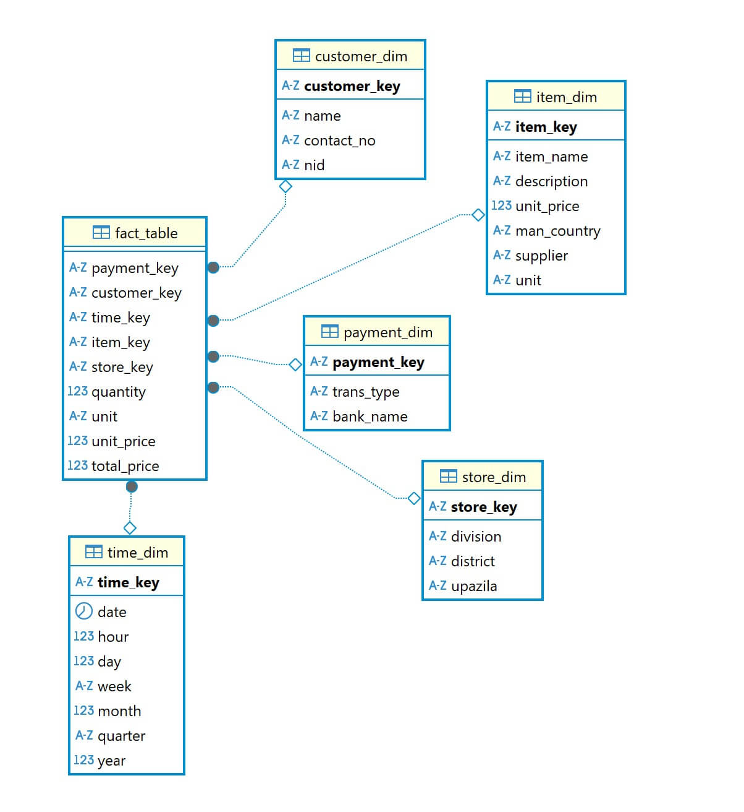

This guide explains how to set up a PostgreSQL database using Docker and restore the E-commerce sample database.

## Prerequisites

- <a href="https://docs.docker.com/get-started/get-docker/">Docker</a> installed on your system
- curl or wget for downloading the sample database
- unzip utility installed
- git installed

## Setup Instructions

1. Clone the repository:

```bash
git clone https://github.com/centralmind/gateway
cd gateway/example/postgresql-ecommerce-sample
```

2. Download the sample database:

```bash
curl -O https://raw.githubusercontent.com/centralmind/sample_databases/refs/heads/main/ecommerce/sample_data.zip
```

3. Make the setup script executable:

```bash
chmod +x setup.sh
```

4. Run the setup script:

```bash
./setup.sh
```

The script will automatically:
- Extract the sample data files
- Pull and start PostgreSQL container
- Create the database schema
- Import all the data from CSV files

## Verification

To verify the setup was successful, you can connect to the database and check the tables:

```bash
docker exec -it some-postgres psql -U postgres -d sampledb -c "\dt"
```

## Connection Details

You can use these connection details to connect to the database:

- Host: localhost
- Port: 5432
- Database: sampledb
- Username: postgres
- Password: mysecretpassword

Create a `connection.yaml` file with these settings:

```bash
echo "hosts:
  - localhost
user: postgres
password: mysecretpassword
database: sampledb
port: 5432" > connection.yaml
```

Or manually create `connection.yaml` with this content:

```yaml
hosts:
  - localhost
user: postgres
password: mysecretpassword
database: sampledb
port: 5432
```

## Database Schema



The E-commerce database includes the following tables:
- fact_table (main transactions)
- payment_dim (payment details)
- customer_dim (customer information)
- item_dim (product details)
- store_dim (store locations)
- time_dim (time dimension for analysis)

Data source: This dataset is based on the [Kaggle E-commerce Dataset](https://www.kaggle.com/datasets/mmohaiminulislam/ecommerce-data-analysis?resource=download)

## Cleanup

To stop and remove the container:

```bash
docker stop some-postgres
docker rm some-postgres
```
