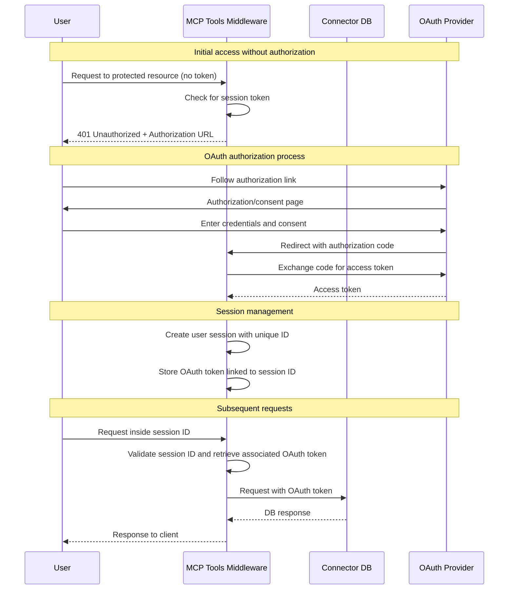

Provides OAuth 2.0 authentication and claim-based authorization for endpoints.

## Type
- Wrapper
- Swaggerer

## Description
Implements OAuth 2.0 authentication with support for various providers (Google, GitHub, Auth0, Keycloak, Okta). Validates access tokens and manages method-level access permissions.

## Authentication Flow

1. **Initial Setup**
   - Configure the OAuth plugin with provider credentials
   - Register your application with the OAuth provider
   - Set up redirect URL in both plugin config and provider settings

2. **Authorization Flow**
   - Client initiates auth by accessing: `/oauth/authorize`
   - Gateway redirects to provider's consent page
   - After user consent, provider redirects back to gateway's callback URL
   - Gateway exchanges the code for access token
   - Returns token to client for future requests

3. **Protected Endpoint Access**
   - Client includes token in requests: `Authorization: Bearer <token>`
   - Gateway validates token with provider
   - If valid and has required scopes, request proceeds
   - If invalid or insufficient scopes, returns 401/403

## MCP Tools Authorization Flow

1. **Middleware Integration**
   - MCP Tools automatically injects authorization middleware
   - Middleware checks for valid session token in requests

2. **Initial Access**
   - When user accesses protected endpoint without token:
     - System returns 401 with OAuth authorization URL
     - User is prompted to follow the authorization link
     - OAuth flow initiates through configured provider

3. **Session Management**
   - After successful OAuth authorization:
     - System creates a session for the user
     - OAuth token is securely stored and associated with session
     - User receives session token for subsequent requests

4. **Protected Operations**
   - All subsequent requests include session token
   - Middleware automatically validates session
   - OAuth token is used internally for protected operations
   - Session persists until explicitly terminated or timeout

### Authorization Sequence Diagram



## Configuration

```yaml
oauth:
  provider: "google"           # OAuth provider (google, github, auth0, keycloak, okta)
  client_id: "xxx"            # OAuth Client ID
  client_secret: "xxx"        # OAuth Client Secret
  redirect_url: "http://localhost:8080/oauth/callback"  # OAuth callback URL
  auth_url: "/oauth/authorize" # Gateway's authorization endpoint (optional)
  callback_url: "/oauth/callback" # Gateway's callback endpoint (optional)
  scopes:                     # Required access scopes
    - "profile"
    - "email"
  token_header: "Authorization" # Header name for the token (default: "Authorization")
  user_info_url: ""          # User info endpoint URL (required for Auth0)
  introspection_url: ""      # Token introspection endpoint (required for Keycloak/Okta)
  mcp_protocol_version: "2025-03-26" # If larget than 2025-03-26 - sse URL will return 401, to force OAuth flow 
  authorization_rules:
    # Public access to health check methods
    - methods: ["GetHealth", "GetVersion"]
      allow_public: true

    # Only administrators can manage users
    - methods: ["CreateUser", "DeleteUser", "UpdateUser"]
      require_all_claims: true
      claim_rules:
        - claim: "roles"
          operation: "contains"
          value: "admin"
        - claim: "org.type"
          operation: "eq"
          value: "internal"

    # API access only for verified users
    - methods: ["GetUserProfile"]
      claim_rules:
        - claim: "email_verified"
          operation: "eq"
          value: "true"

    # Access only for specific organization
    - methods: ["GetOrganizationData", "UpdateOrganizationData"]
      require_all_claims: true
      claim_rules:
        - claim: "org.id"
          operation: "eq"
          value: "{{.OrganizationID}}"  # Support for request parameters
        - claim: "org.status"
          operation: "eq"
          value: "active"

    # Regular expression check
    - methods: ["GetDepartmentData"]
      claim_rules:
        - claim: "department"
          operation: "regex"
          value: "^(HR|Finance|IT)$"
```

## Built-in Endpoints

The plugin automatically adds these endpoints to your gateway:

### 1. Authorization Endpoint
```
GET /oauth/authorize
```
Initiates the OAuth flow by redirecting to the provider's consent page.

### 2. Callback Endpoint
```
GET /oauth/callback
```
Handles the OAuth provider's redirect callback:
- Exchanges authorization code for access token
- Returns token to client
- Optionally redirects to specified URL with token

## Provider-Specific Configuration

### Google
```yaml
oauth:
  provider: "google"
  client_id: "xxx.apps.googleusercontent.com"
  client_secret: "xxx"
  scopes:
    - "https://www.googleapis.com/auth/userinfo.profile"
    - "https://www.googleapis.com/auth/userinfo.email"
```

### GitHub
```yaml
oauth:
  provider: "github"
  client_id: "xxx"
  client_secret: "xxx"
  scopes:
    - "read:user"
    - "user:email"
```

### Auth0
```yaml
oauth:
  provider: "auth0"
  client_id: "xxx"
  client_secret: "xxx"
  user_info_url: "https://your-tenant.auth0.com/userinfo"
  scopes:
    - "openid"
    - "profile"
    - "email"
```

### Keycloak
```yaml
oauth:
  provider: "keycloak"
  client_id: "xxx"
  client_secret: "xxx"
  introspection_url: "https://your-keycloak/auth/realms/your-realm/protocol/openid-connect/token/introspect"
  scopes:
    - "openid"
    - "profile"
```

### Okta
```yaml
oauth:
  provider: "okta"
  client_id: "xxx"
  client_secret: "xxx"
  introspection_url: "https://your-org.okta.com/oauth2/v1/introspect"
  scopes:
    - "openid"
    - "profile"
```

## Security Considerations

1. Always use HTTPS in production
2. Keep client_secret secure
3. Validate redirect_urls to prevent open redirect vulnerabilities
4. Implement state parameter to prevent CSRF attacks (implemented by default)
5. Validate tokens on every request
6. Use appropriate scopes - principle of least privilege
7. Configure proper CORS settings when using as API gateway
8. Regularly rotate client secrets
9. Monitor and log authentication attempts 

## Authorization Rules

The plugin supports flexible claim-based authorization rules that can be applied to specific methods or groups of methods.

### Rule Configuration

```yaml
oauth:
  # ... other oauth config ...
  authorization_rules:
    # Public access to health check methods
    - methods: ["GetHealth", "GetVersion"]
      allow_public: true

    # Only administrators can manage users
    - methods: ["CreateUser", "DeleteUser", "UpdateUser"]
      require_all_claims: true
      claim_rules:
        - claim: "roles"
          operation: "contains"
          value: "admin"
        - claim: "org.type"
          operation: "eq"
          value: "internal"

    # API access only for verified users
    - methods: ["GetUserProfile"]
      claim_rules:
        - claim: "email_verified"
          operation: "eq"
          value: "true"

    # Access only for specific organization
    - methods: ["GetOrganizationData", "UpdateOrganizationData"]
      require_all_claims: true
      claim_rules:
        - claim: "org.id"
          operation: "eq"
          value: "{{.OrganizationID}}"  # Support for request parameters
        - claim: "org.status"
          operation: "eq"
          value: "active"

    # Regular expression check
    - methods: ["GetDepartmentData"]
      claim_rules:
        - claim: "department"
          operation: "regex"
          value: "^(HR|Finance|IT)$"
```

### Supported Operations

- `eq` - Exact value match
- `ne` - Value is not equal
- `contains` - Array contains value
- `regex` - Value matches regular expression
- `exists` - Check if claim exists

### Claim Path Syntax

Supports access to nested fields using dot notation and array indices:

- `email` - simple field
- `org.name` - nested field
- `groups[0]` - array element
- `org.departments[0].name` - combination of nesting

### Dynamic Values

Request parameters are supported in rule values using Go template syntax:
- `{{.ParamName}}` - value from request parameters
- `{{.Method}}` - method name
- `{{.Path}}` - request path

### Examples

1. **Basic Role-Based Authorization**:
```yaml
authorization_rules:
  - methods: ["CreateUser", "DeleteUser"]
    claim_rules:
      - claim: "roles"
        operation: "contains"
        value: "admin"
```

2. **Organization Membership Check**:
```yaml
authorization_rules:
  - methods: ["GetOrganizationData"]
    require_all_claims: true
    claim_rules:
      - claim: "org.id"
        operation: "eq"
        value: "{{.OrganizationID}}"
      - claim: "org.status"
        operation: "eq"
        value: "active"
```

3. **Email Domain Check**:
```yaml
authorization_rules:
  - methods: ["InternalAPI"]
    claim_rules:
      - claim: "email"
        operation: "regex"
        value: "@company\\.com$"
```

4. **Public Methods**:
```yaml
authorization_rules:
  - methods: ["GetPublicData", "Health"]
    allow_public: true
```

## Configuration Examples

### 1. Public API with Location-Restricted Events

This example demonstrates how to configure a public API where all methods are accessible to everyone, except for specific methods that require users to be located in Berlin. This can be useful for local community events, regional features, or location-specific content.

```yaml
oauth:
  provider: "github"
  client_id: "xxx"
  client_secret: "xxx"
  redirect_url: "http://localhost:8080/oauth/callback"
  scopes:
    - "read:user"
    - "user:email"
  authorization_rules:
    # Default rule - make all methods public
    - methods: ["*"]
      allow_public: true

    # Override for Berlin-only community events
    - methods: 
        - "RegisterForBerlinCommunityEvent"
        - "GetBerlinEventDetails"
        - "UpdateBerlinEventRegistration"
      require_all_claims: true
      claim_rules:
        - claim: "location"
          operation: "eq"
          value: "Berlin"

    # Optional: Additional rules can be added for specific methods
    - methods: ["UpdateUserProfile"]
      claim_rules:
        - claim: "type"
          operation: "eq"
          value: "User"
```
